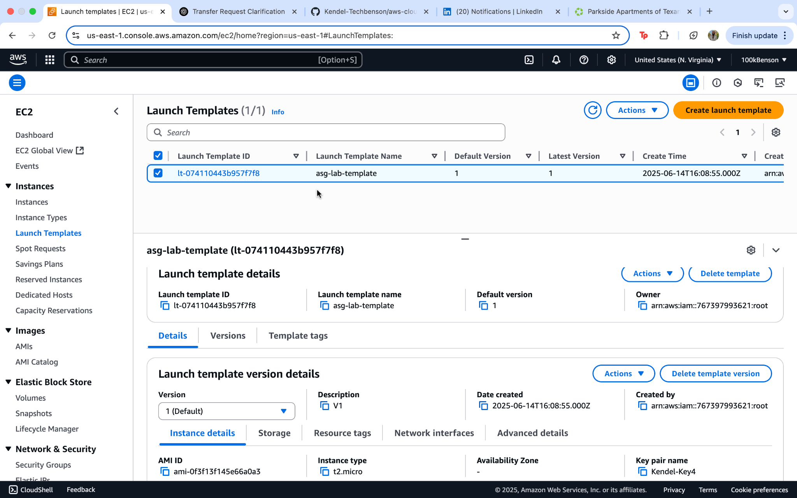
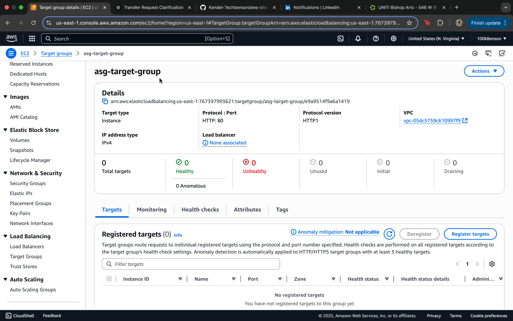
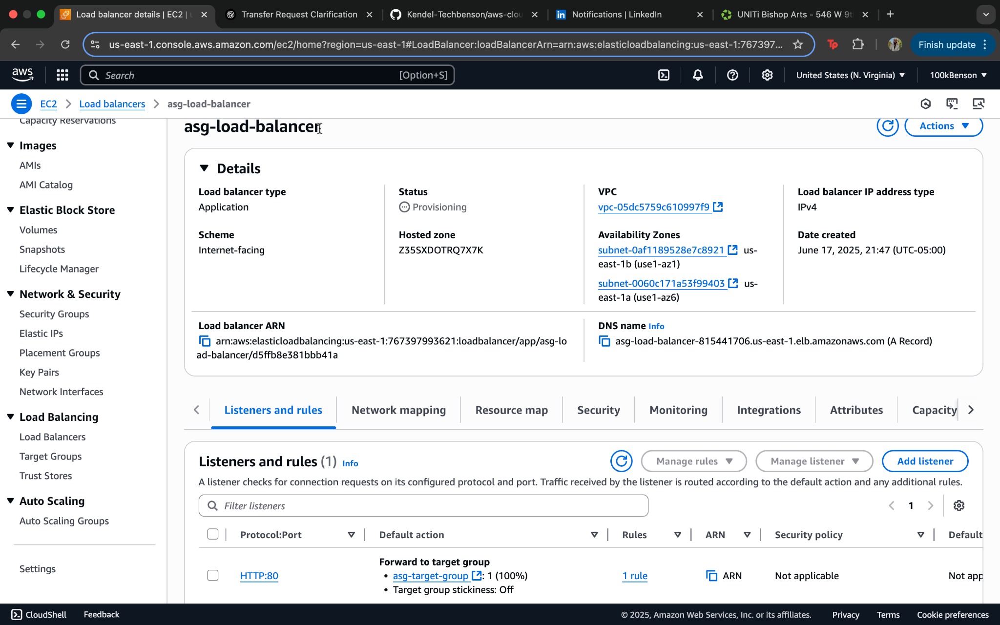
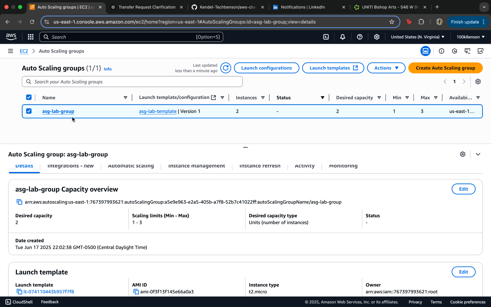
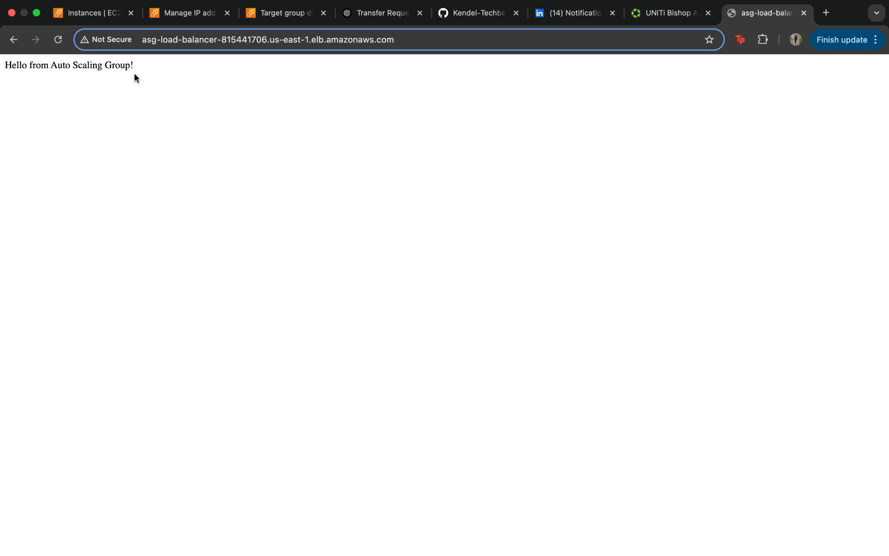

# Auto Scaling Group + Application Load Balancer Lab (AWS)

## 🧠 Overview
This lab demonstrates how to automatically launch and manage EC2 instances using an Auto Scaling Group behind an Application Load Balancer (ALB). It simulates real-world infrastructure used in production environments to handle high availability and traffic distribution.

---

## 🔧 Services Used
- EC2 (Launch Template)
- Auto Scaling Group (ASG)
- Application Load Balancer (ALB)
- Target Groups
- Cloud-init (user data)
- Security Groups
- Amazon Linux 2

---

## 🛠️ What I Built
- A **Launch Template** with user data to install Apache and serve a custom message
- A **Target Group** to monitor EC2 instance health
- An **Application Load Balancer** forwarding HTTP traffic to the target group
- An **Auto Scaling Group** that maintains 2 EC2 instances (min 1, max 3)

---

## 📸 Screenshots

### 1. Launch Template Created

### 2. Target Group Created

### 3. Load Balancer Created

### 4. Auto Scaling Group Created

### 5. Website Successfully Loaded

---

## 🔍 Key Concepts Practiced
- Launch Template versioning and network config
- Health check troubleshooting (504 Gateway Timeout fix)
- Registering EC2 instances in a target group
- Traffic routing through ALB to ASG-managed EC2s
- Using User Data to auto-install & start services
- Understanding how scaling and availability tie together

---

## 🧪 Real-World Relevance
This setup mirrors what cloud support engineers troubleshoot in AWS daily: 
- Broken load balancers
- Failing health checks
- Scaling failures
- Misconfigured EC2s or security groups

---

## ✅ Result
The Load Balancer DNS successfully displayed the Apache-hosted web page:
> “Hello from Auto Scaling Group!”
